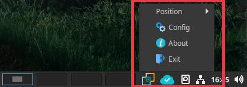
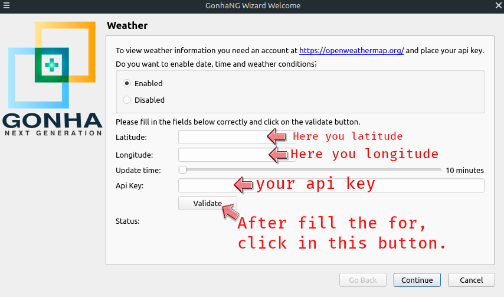
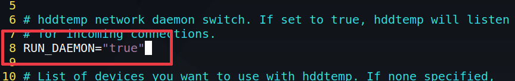

[](https://copr.fedorainfracloud.org/coprs/fredcox/gonhang/package/gonhang/)
[](https://www.python.org/)
[](https://badge.fury.io/gh/fredcox%2Fgonhang)
[](https://badge.fury.io/py/gonhang)
[](https://github.com/fredcox/gonhang/issues)
[](https://github.com/fredcox/gonhang/network)
[](https://github.com/fredcox/gonhang/stargazers)
[](https://github.com/fredcox/gonhang/blob/master/LICENSE)

# GonhaNG - The Next Generation Light-Weight System Monitor for Linux


1. [News](#news)
2. [About](#about)
3. [Features](#features)
4. [Install](#install)
5. [Enable Weather Forecasts](#enable-weather-forecasts)
6. [Enable hddtemp](#enable-hddtemp)
..6. [Enable hddtemp on Ubuntu Based Distros](#enable-hddtemp-on-ubuntu-based-distros)
..6. [Enable hddtemp on Fedora32 or Arch Linux based Distros](#enable-hddtemp-on-fedora32-or-arch-linux-based-distros)    
7. [Contributos](#contributos)
8. [Screenshots](#screenshots)
9. [Buy me a Coffee](#buy-me-a-coffee)
10. [License](#license)


## News

## About


**GonhaNG** is a lightweight, practical, easy to configure and intuitive system monitor for Linux . Was developed in 
**Python 3** with **PyQt 5**, **GonhaNG** was motivated to provide a system monitor for Linux that is 
quick to install and does not need to write parameters in extra configuration files and endless visual adaptations . 
It is easy to install and the configuration is performed through a **graphical wizard-** type interface , 
where everything is done **on the fly** , that is, the user does not need to restart the application to view 
the changes, the choices are updated and shown by the application in real time.

However, there are some applications that work together with **GonhaNG** , which need to be configured separately, 
for example:

1. To show the **weather** forecasts, it is necessary to register on [Open Weather](https://openweathermap.org/) 
(it is free) and obtain an **api key**. 
2. To display temperatures of the **SSD** and **HDD** devices, you need configure **hddtemp** as a **daemon** .


***GonhaNG*** is a System Monitor for several important **hardware** variables.

## Features

- System **tray icon**
- Lightweight and takes up **few resources** on your system
- **Easily** configurable through a **wizard** graphical interface

## Install

Choose your distro in the following sections and after installing and running GonhaNG, 
**right-click** on the **GonhaNG Icon System Tray** and the **main menu** will be shown. 
Now, you can modify several characteristics of configurations, such as:

- The position on the screen
- CPU Temperature
- Network conditions
- Weather Forecasts
- Partitions
- HDD/SSD/Nvme Temperatures

Access the **wizard**, through the config option:




### Ubuntu, Debian and derivatives (Linux Mint, MX Linux)

```bash
$ sudo add-apt-repository ppa:fredcox-p/gonhang
$ sudo apt update
$ sudo apt install gonhang
```

### Arch Linux and derivatives (Manjaro)

```bash
$ yay -S gonhang
$ gonhang
```

### Fedora32

```bash
$ sudo dnf copr enable fredcox/gonhang
$ sudo dnf update
$ sudo dnf install gonhang
```

# Enable Weather Forecasts

As previously mentioned, to show the weather forecasts, it is necessary register (free) [Open Weather](https://openweathermap.org/) 
and obtain an **api key** , for this, go to the website [https://openweathermap.org/](https://openweathermap.org/, 
complete the registration and log in.

You can obtain your geographical coordinates through the following website: [https://www.latlong.net/](https://www.latlong.net/).

After you have all the geolocation information and your api key, please fill in the GonhaNG Weather form 
(right click on the system tray and navigate to the config option), as image bellow:




>You need fill the Weather form in GonhaNG config Wizard with your api key, latitude and longitude. After this, press
>the button validate, because the weather only will display if you put correct information and GonhaNG validate. If you
>put wrong api key, wrong geolocalization (latitude and longitude), no magic. 


# Enable hddtemp 

I you want **GonhaNG** display SSD´s/HHD´s and nvme´ temperatures, so you need **hddtemp** running as daemon and 
listening on port **7634** . Please see in your distro how to **enable and start hddtemp as service**.

## Enable hddtemp on Ubuntu Based Distros

Edit the file **_/etc/default/hddtemp_** and change the line **RUN_DAEMON=”false”** to  **RUN_DAEMON=”true”**, as shown below




## Enable hddtemp on Fedora32, Arch Linux e derivatives

It is easy, you need the commands bellow to enable and start hddtemp in yout distro:

```shell script
$ sudo systemctl enable hddtemp
$ sudo systemctl start hddtemp
```

## Contributos

1. [Fred Lins](https://github.com/fredcox) :hammer_and_wrench: 
2. [Carlos Fagiani Junior](https://github.com/fagianijunior) :hammer_and_wrench: 
3. [Geraldo S. Simião Kutz](https://t.me/@GeraldoSSK) :hammer_and_wrench:
 

## Screenshots


## Buy me a Coffee

<a href="https://www.buymeacoffee.com/fredcox" target="_blank"></a>


## License 

This project use **MIT License**
